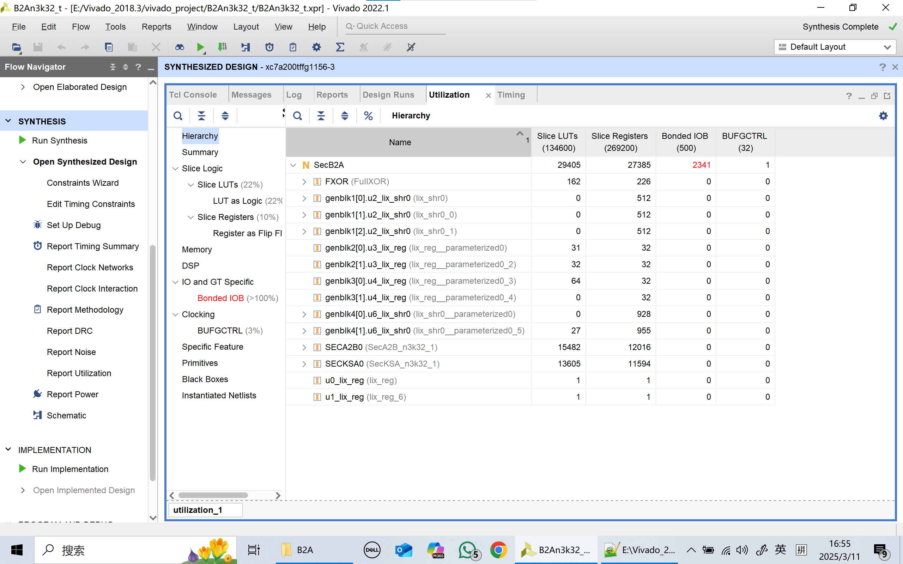
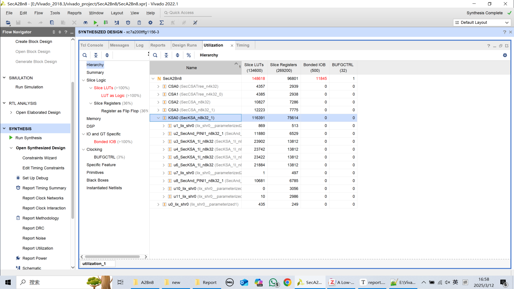
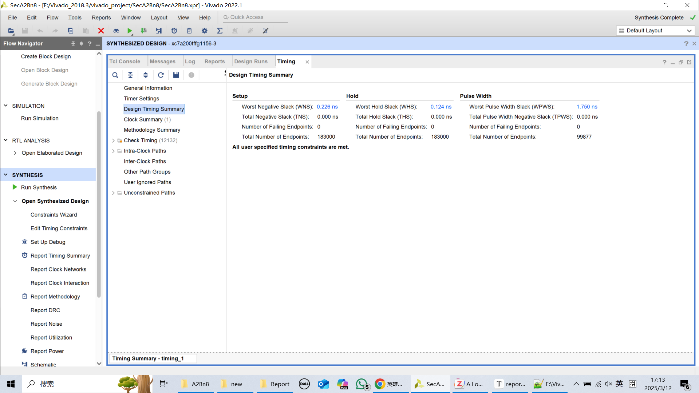

#### SecB2A, n = 3, k = 32

#### SecA2B, n=8, k=32

- SecA2B with parallelization

- SecA2B Baseline

- 总结

使用论文中提到的XC7A200TFFG1156-3 FPGA芯片

n=3时时钟周期设置为2.7ns，xdc仅约束了时钟周期（其中A2B模块的结果与原文的结果有差别，可能因为没设置其他约束）

n=8时比较了Python生成的电路与并行化的电路，并行化的电路延迟减小4个时钟周期（原电路为24个时钟周期），时钟周期设置为4.5ns；且由于CSA的位数减小，使用的LUT和Registers有所减少，但是所用资源均超出了FPGA芯片的资源

